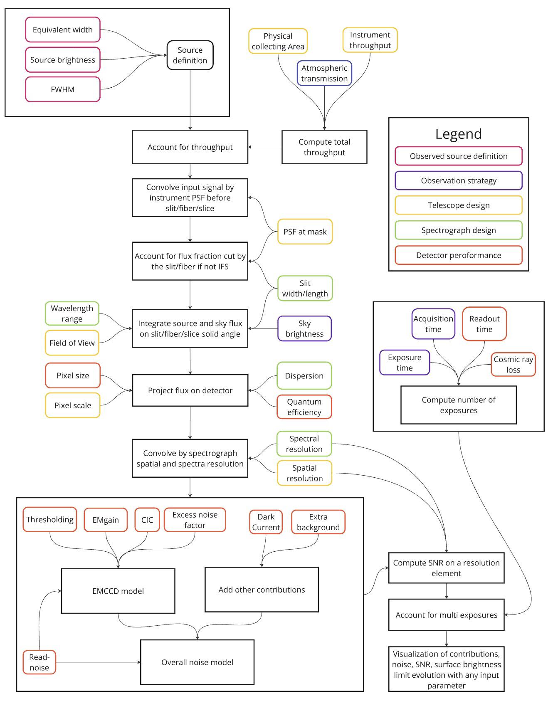

[](https://mybinder.org/v2/gh/vpicouet/fireball2-etc/main?labpath=notebooks%2FETC.ipynb)

Click on the video to access to the ETC
[](https://spectro-imager-etc-fbcad4e5849d.herokuapp.com)
You can add your instrument characteristics [here](https://docs.google.com/spreadsheets/d/1Ox0uxEm2TfgzYA6ivkTpU4xrmN5vO5kmnUPdCSt73uU/edit?usp=sharing), in the "In progress" tab. As soon as the instrument characteristics are all indicated, the instrument will be added to the main tab and will be available on the ETC and image simulator.

[](https://docs.google.com/spreadsheets/d/1Ox0uxEm2TfgzYA6ivkTpU4xrmN5vO5kmnUPdCSt73uU/edit?usp=sharing)


# <center>ETC - SNR calculator </center>

## Description
This straightforward ETC provides an estimated signal-to-noise ratio for any spectro-imager instrument. Its key attributes lie in its versatility, user-friendly interface, and diverse plotting options. The ETC is designed to accommodate any spectro-imager, and scientists can effortlessly contribute new instruments or configurations [here](https://docs.google.com/spreadsheets/d/1Ox0uxEm2TfgzYA6ivkTpU4xrmN5vO5kmnUPdCSt73uU/edit?pli=1#gid=2066284077) for direct utilization within the tool.
The ETC 

The ETC GUI serves as a valuable resource, offering a quick overview of not only the essential instrument parameters and constraints but also presenting insights into tradeoffs, potential optimizations, and mitigation strategies. Currently, there are two primary visualization options: the SNR plot and the image simulation, both capable of accommodating all instruments stored in the [spreadsheet](https://docs.google.com/spreadsheets/d/1Ox0uxEm2TfgzYA6ivkTpU4xrmN5vO5kmnUPdCSt73uU/edit?pli=1#gid=2066284077). 
For integral field units (slicers, fiber IFU, etc), there is a third plot that shows the data cube in the 2D spatial dimension and spectral dimension. These visualizations dynamically adjust as parameters are modified using the intuitive widgets.

## Interest and Philosophy

Exposure Time Calculators (ETCs) are integral tools for optimizing observational strategies in astronomy, typically tailored to specific instruments. However, there has been a notable development of universal ETCs capable of accommodating diverse telescope and spectrograph configurations
This paper introduces a new approach in ETC, aiming for broader applicability, with a high level of genericity.  [while maintaining precision comparable to specialized counterparts like ETC-42]
In opposition to usual ETC's, its goal goes beyond their nominal use of predicting the SNR of a source given some instrument parameter
Indeed, as others ETC, it provides an image simulator that can predict observations in order to Improve reduction pipeline or adapt detection strategy
But more importantly it allows to see analyze the evolution of the SNR with all the instrument parameters, allowing to Examine the instrument efficiency, explore the SNR evolution under different scenarios, run different trade studies.
The ETC is linked to an online database (spreadshseet) to allow any scientist to add their own spectrograph instrument. 
The current version already encompass more than 20 instruments, some with several channels or configurations.
This tool proves valuable for trade-off analysis and instrument comparisons.
Despite being a personal initiative with modest resources, it serves as an illustrative example of development simplicity and collaborative database utilization.
Observations predictions have been cross checked with ETC-42 based on several spectrgraph design.
This article briefly outlines its development philosophy and significant role in facilitating trade-off analyses for future instrument developments, such as the FB project.


## Variables

The different instrument parameters used can all be used in the x-axis to analyze the impact on SNR.
Their units description can also be found in the instrument spreadsheet (as remarks). As well as when the user put the cursor on each widget name.
- **Source:** 
  - **Flux**: erg/cm$^2$/s/arcsec$^2$/Å
  - **Sky**: Level of sky background illumination in ergs/cm$^2$/s/arcsec$^2$/Å
  - **Source extension**: Spatial extension of the source in arcseconds " (σ)
  - **Source's line width**: Spectral extension of the source/emission line in Å
- **Observing strategy:** 
  - **Observed wavelength**: Effective wavelength of the instrument in nanometer
  - **Exposure time**: Exposure time of individual frames in seconds
  - **Total acquisition time**: Total acquisition time in hours
  - **Atmospheric transmission**:  %/100
  - **Distance to source/line center**: Distance to the source being analyzed ['' or Å]
- **Instrument design:** 
  - **Collecting area**: Physical collecting area of the instrument in m$^2$
  - **Plate scale**: Pixel plate scale in  ''/pix
  - **Throughput**: Instrument throughput at effective wavelength (not accounting for detector quantum efficiency and atmospheric transmission)
  - **Spatial resolution** (at the mask and at the detector): 
- **Spectrograph design:** 
  - **Spectral resolution**: Spectrograph spectral resolution λ[Å]/dλ[Å]
  - **Slit width**: Width of the slit/slice/fiber in ''
  - **Slit length**: Length of the slit/slice/fiber in ''
  - **Dispersion**: Dispersion at the detector Å/pix 
- **Detector parameters:** 
  - **Quantum efficiency**: Detector quantum efficiency in %/100
  - **Dark current**: Detector dark current [e-/pix/hour]
  - **Read noise**: etector readout noise in electrons/pixel
  - **Readout time**: Time in seconds that it takes for images to get read. Use 0 for MCPs or rolling shutter
  - **Pixel size**: Pixel size in microns
  - **Image loss due to cosmic ray**: Cosmic ray loss per second. eg. 0.01 would mean that 1 sec image looses 1\% pixels due to cosmic rays
  - **extra_background**: Any additional source of straylight (could be any internal or external contribution/leak), in  addition to the nominal sky background
- **emCCD additional parameters:** 
  - **EM gain**: EMCCD amplification gain in e-/e-
  - **CIC**: EMCCD spurious charges due to amplification in electrons [e-/pix]
  - **Thresholding**: 
  - **Smearing exponential length (~CTE)**: Smearing length of the EMCCD (exponential length in pixels). This length, representing the charge transfer efficiency is fixed by the temperature when the Temp checkbox is checked.
  - **Temperature**: if you check it (based on a first rough evolution of smearing and dark current with temperature, therefore changing the temperature will change smearing and dark accordingly.)
- **Image simulator-related parameters:** Full well of the detector
  - **Conversion gain**: to convert e- into detector ADU (ADU/e-)
  - **Throughput FWHM**  taking into account all optics and QE, not atmosphere, to add the λ dependency.
  - **Atmospheric transmission** [checkbox] to add a λ-depend transmission model (based on [pwv_kpno](https://mwvgroup.github.io/pwv_kpno/1.0.0/documentation/html/atmospheric_modeling.html)) for ground instruments (this only applies to the source, not to the sky emission)
  - **Atmospheric emission lines**: checkbox] replaces a flat sky continuum by sky emission lines based on [UVES estimates](https://www.eso.org/observing/dfo/quality/UVES/pipeline/sky_spectrum.html) 


## Outputs

### SNR visualization
The SNR plot is crafted to offer a straightforward depiction of noise budgets concerning various variables that can be fine-tuned or mitigated to enhance instrument sensitivity. In the top panel, the noise from distinct sources (Signal, Dark, Sky, CIC, RN) is presented in electrons per pixel. The middle panel provides the average electron-per-pixel value for each component (pre-stacking). The last plot outlines the relative fractions of all noise sources per resolution element per N frames over the total acquisition time and the resulting SNR on a resolution element


### Spectra simulator

The image simulator utilizes the various parameters and a specific source (galaxy/stellar spectra) to simulate the following:
- **single & stacked image:** Presented in the upper left and right sections, these images are 100 × 500 pixels (resulting in distinct physical FOVs for different instruments). The spectral direction is horizontal, while the spatial one is vertical. The slit size is incorporated, along with contributions from different noise sources.
- **Histogram:** Lower left plot displays the histogram for both individual and stacked images.
- **Profiles:** Lower right plot offers profiles in both spatial and spectral directions for the single (large & transparent) and stacked images.

The code assumes a standard (λ-dependent) atmospheric transmission for ground instruments. Users are encouraged to upload their instrument throughput/QE λ-dependency on the GitHub repository (under notebook/interpolate) using the format "Instrument_name.csv" (λ in nanometers on the first column and with no column name). If no table is added, the code will default to using the Throughput_FWHM value in the spreadsheet.


### IFU cube simulator


# <center>Contributions calculations in Electrons per pixel </center>

## Sky and signal
The sky and signal contributions are first converted from $ergs/cm^2/s/asec^2/Å$ to photons/cm $^2$/s/sr/Å (continuum unit): $CU =   \frac{Flux}{\frac{h c}{ \lambda} \times \frac{\pi}{ 180 \times 3600}^2 }$

Note the wavelength dependency in the formula. 
We decided deliberately to use flux per Angstrom with a gaussian profile so that the user can simulate both a continuum or an unresolved line. 
Users can also directly upload spectra in  $ergs/cm^2/s/asec^2/Å$ in the GitHub repository (under notebooks/Spectra, λ in nanometers on the first column and with no column name).

Then, both contributions are converted similarly into electrons per pixels:


$$Sky_{e-/pix/exp} = Sky_{CU} \times Slitwidth_{str}  \times Dispersion_{Å/pix}  \times Texp_{s} \times Atm_{٪} \times  Area_{٪} \times Throughput_{٪}  \times QE_{٪}  $$

$$Signal_{e-/pix/exp} = Signal_{CU} \times min(Slitwidth_{str},SourceSize_{str})  \times Dispersion_{Å/pix} \times Texp_{s} \times Atm_{٪} \times  Area_{٪} \times Throughput_{٪}  \times QE_{٪}  $$

<!-- If the instrument is an imager (no slit and no dispersion), we replace the factor $ Slitwidth_{str}  \times Dispersion_{Å/pix}$ by $FOV_{str} \times Bandwidth_{Å} $. -->

## Other contributions

Other contributions (dark current, read-noise, CIC, straylight) are easier to account for.
Dark and straylight are used with the same unit: $e-/pix/hour$. Therefore:

$Dark_{e-/pix/exp} = Dark_{e-/pix/hour} \times \frac{ Texp_{s} }{3600}$

CIC (Clock induced charges) which are charges induced in electron amplified CCD, are already given in e-/pix/exp.
Read noise is usually also given in e-/pix/exp.

## <center>Conversion to noise </center>


Each contribution is then converted to noise by taking the square root of the contribution and accounting for the effective number of frames and the element resolution size: 

$N_{Contribution} = \sqrt{Contribution [\times ENF] \times N_{images} \times Size_{resolution element} }$

The number of effective images is:

$$N_{images} = \frac{Ttot_{s}}{Texp_{s} + Tread_{s}} \times (1-CRloss_{٪}) $$

In the case of electron-amplified CCDs, some considerations must be taken into account:
- the read noise must be divided by the amplification gain: $RN_{e-/pix/exp} = \frac{ RN_{e-/pix/exp} }{EMGain_{e-/e-}}$
- an excess noise factor of $\sqrt{2}$  must be used to account for the stochastic amplification (if no thresholding method is applied)





# Installing locally spectro-imager-etc


- Installing a new conda environement
```
conda create --name etc python=3.12
conda activate etc
```
- Download and install the github package
```
git clone https://github.com/vpicouet/spectro-imager-etc.git
pip3 install -e .
```
If you want to pull any new update just run 
```
git pull
```